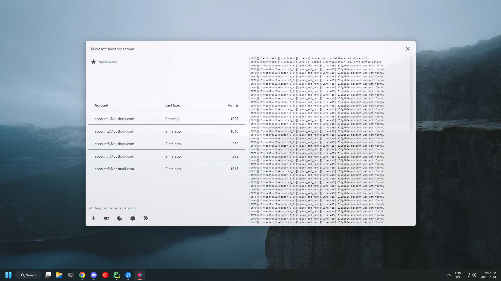
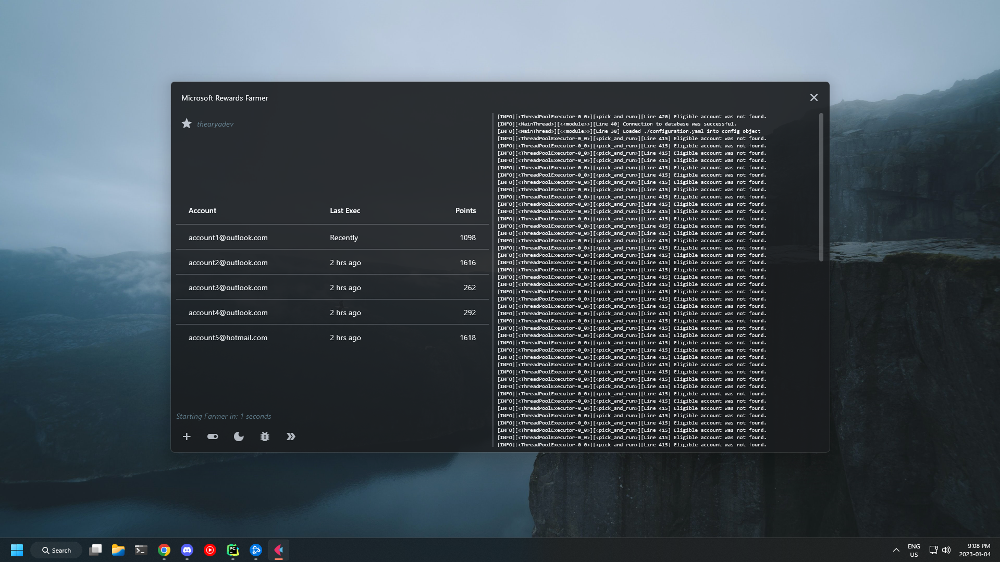
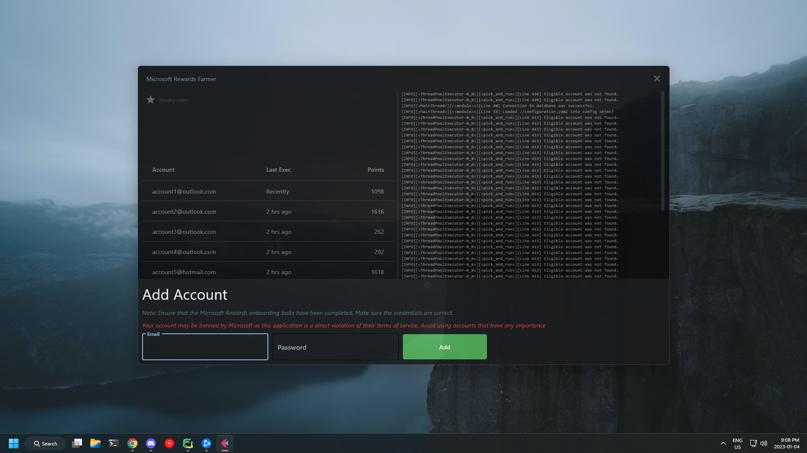

```
### v0.6b Changes: 
- Support for Server instance (see `Installation: Server` in README)
- Changed to Poetry for dependency management
- Minor UI changes 
- Update error report file name to include email address of account which the error occured in. 
- Max accounts changed from 8 to 10
```


# Microsoft Rewards Famer (MSRF)


This project is a automated farmer for Microsoft Rewards. It will log into given accounts and complete surveys, quizzes, and conduct bing searches. The farmer will automatically schedule runs to farm points for each account. More details on what exactly it is doing is outlined below.

**Usage of this application may get your Microsoft account permanently banned. I take no responsibility for any actions made on your account.**

This project is a rewrite of ["Microsoft-Rewards-Farmer"](https://github.com/charlesbel/Microsoft-Rewards-Farmer). The goal of this project is to move towards a documented and test driven code base. The entire code base has been restructured, and over 90% of it is re-written. Some components from the original project still exist within this one.

## Demo




## Installation: Windows Application

Download the zip file from the Github releases for this project. It will include everything needed to run this program, including: 
  - The main executable
  - Chrome
  - Chromedriver Binary

Run the executable to start the program.

*Note: The bundled Chrome and Chromedriver binaries will likely be outdated. This is to prevent breaking changes in Chrome and Chromedriver from affecting the program. For every major release, both bundled binaries will be updated. When using this program, you accept the risk of using unsecure software that may compromise the overall security of your system.


# Installation: Server

Server instances are possible. This is currently being tested. 
Not all features are supported on a Linux server instance of this application. 

Server installation is supported through Docker. 
The following steps assumes: 
- Docker is installed correctly.
- unzip is installed correctly. 
- curl is installed correctly.

Installation steps: 
1. Create a new directory to work with the project files. This example will use `./msrf-home`. `cd ./msrf-home`
2. Run the following command: ```curl -o msrf-v0.6b.zip https://codeload.github.com/thearyadev/MSRF/zip/refs/tags/v0.6b && unzip msrf-v0.6b.zip && rm msrf-v0.6b.zip```
3. A new directory has been created, `./msrf-home/MSRF-0.6b`. CD into this directory. 
4. Open the file `./msrf-home/configuration.yaml` in an editor. Change the line `mode: APPLICATION` to `mode: SERVER`
5. Run the command `docker build -t msrf_06b .`. This will create a docker image.
6. Run the command `docker run -d -p 50947:50947 msrf_06b`
7. Navigate to `http://<IP_ADDRESS>:50947` in your web browser. 

Steps for deploying this docker container on Windows is similar. Step 2 simply downloads and extracts the source code for the latest release. 

Work in progress.
## Development

This project was developed in Python 3.10.8 and has **not** been tested with any other version of python. 
The valid Python range is 3.10 -> 3.12. Most are untested.

This project uses Poetry for dependency management. 
Using poetry, run `poetry install` in the root of the project directory. This will install all dependencies.

Tests use environment variables to load some testing account credentials. Check the tests module for more information.

```bash
python -m pip install -r requirements.txt
```

Selenium requires a Chromedriver binary and Chrome installation. This is automatically detected assuming you have correctly configured both on your machine.
This behavior can be changed temporarily for development. Browser initialization is done in the file `./util/browser/browser_setup.py`. Here you can configure custom chromedriver and chrome binary paths.

## Information
### Yields
I haven't recorded any numbers for how well this works. I do know that not all quizzes will be completed, sometimes the daily set won't fully complete, and you may not get the streak for that day. 
If the quiz types change, or new data is present that I have not designed this farmer around, they will not be completed. 

That being said, from my testing and observation, a level 2 microsoft rewards account seems to get 150-250 points per day. 
This number can be increased by manually ensuring that the daily set is completed, so that you gain streak bonuses, and that any additional quizzes or polls that the bot is unable to do are completed. 

`07/01/2023` - Some surveys don't work. Fixes maybe soon :)

### Bans
I've been developing this for about a month now. I haven't been banned on the 4 accounts that I have been testing on. After redeeming excess of $25 worth of rewards, and continuously running this daily, not one account has been banned. 

Microsoft may change their methods of banning at any time. Use accounts that you do not value, and redeem your reward as soon as you have enough points. 

I'm also not currently aware of any IP bans or rate limits for a single IP when it comes to point collection and reward redemption, as I haven't encountered this in my testing. If this concerns you, i advise you use a VPN. If this becomes a major problem I may incorporate proxy servers into this project.

### Breaking Changes
Microsoft can make changes at any time. They may break the farmer. I've designed this so that whichever component does not work, is simply skipped, outputting a critical error then continuing to the next task. 
When breaking changes are known, I will work towards fixing them. 

### Not working? 
The most common problem I've seen in testing is login problems. The prompt may say something like invalid credentials, which may be the case. 
Microsoft sometimes has other steps to the login, which I have not considered. 

If an account is continuously failing to log in, you can enter "debugging mode" by clicking the bug icon at the bottom control panel. This will show the Chrome browser that is being used by the program, and will allow you to see what is preventing the login. 

For example: 
- Invalid credentials
  - You will be able to see the program attempt to log in, and view the full error message sent by microsoft authentication
- Additional Login steps
  - "Please verify your security information". This will require you to click a button to confirm, which will block the program from running on your account.
  
If other errors are occurring, you can use debugging mode to determine why those issues are arising.

### Updates
When the program gets updated, it will reveal an update prompt. It is important to keep this app up to date, to prevent your account from getting banned. 

This project currently has no update/installer. It is just a zipped folder with an executable in it. To copy your accounts over, copy the `accounts.sqlite` file to the directory that contains the updated files. 

### Bugs & Feature Requests

Open an issue on this Github repository. Outline the problem to the best of your ability. 
Be sure to include a screenshot of the log window to show any reported errors, if any. 

- Error Reporting
	- Errors that cause fatal errors in a module (critical errors) will be logged using the Error Reporting module. 
	- This will create a zipfile in the ./errors directory in the same location as the executable. 
	- the errors directory will contain all errors thrown by the application. 
	- Error Information
		- Account data (Same account data used for earning points, this information does not contain any account credentials, only account information like: point count, available promotions, etc.) 
		- Browser screenshot at the time of the error. This may include the account name, and potentially the account email. If you plan on sharing this (such as in a Github issue), you may want to cover any personal information
		- A traceback. This is the exception raised by python. 
		- The HTML page at the time of the error. This helps in determining exactly why an error happened, but this file will have personal information, such as your email address and name. You may not want to include this when sharing this with other people. If you are familiar with HTML structure, you can find and remove that personal information before sharing. 
		- the url that the exception occurred on.
	- This module is primarily made to help me find and address problems with the scrapers, but also to give you a simple way to report errors when they happen. 

Unzip your error report, and remove any personal information from it. You can then include it in the Github issue. Without an error report, you may not get help, as it is very hard to determine what the cause of a bug in this program is. 

Please use the Github issue template for all bugs and feature requests. 

## Development Roadmap / Known Issues
- Tests for Microsoft Rewards, Farmer. 
- purge errors once the errors directory contains more than 50 entries. 
- complete documentation of all components and modules
- fix a bug where 12 points worth of PC searches are not completed.
- fix question # count. Some start at 0 instead of 1.
- add detailed error descriptions for error report. ie: what is the farmer trying to do
- add an additional data field to the error report so each individual error report can include some extra data where applicable
  - for example: the task it was trying to complete at the time of the error
  - locals
  - globals
  - etc.
- fix a problem with account password which a space/newline is recorded. This will break login and theres no easy way to determine what the problem is.
- add function to error report zipfile name to make specific errors easily identifiable
- rebuild login function
  - Better error reporting, attempt to determine what the actual problem is. 
  - Support for mobile authentication is messy and causes a bunch of false errors.
- Add upload and download button for the `accounts.sqlite` file. 

## Contributing

There are no contributing guidelines (for now). 


## 🚀 About Me
I'm a developer. Actively learning and looking for new and interesting opportunities. Send me a message: aryan@aryankothari.dev


## License

[Apache-2.0](/LICENSE)

